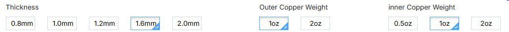
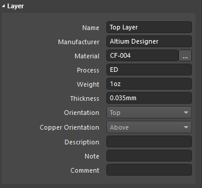
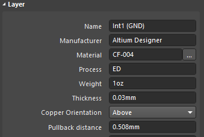
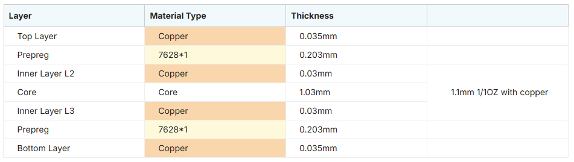
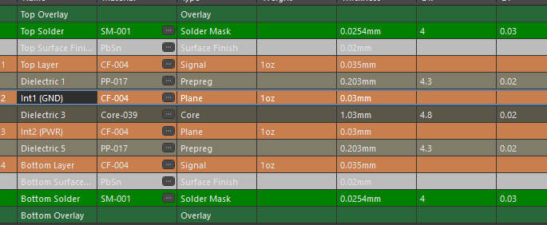
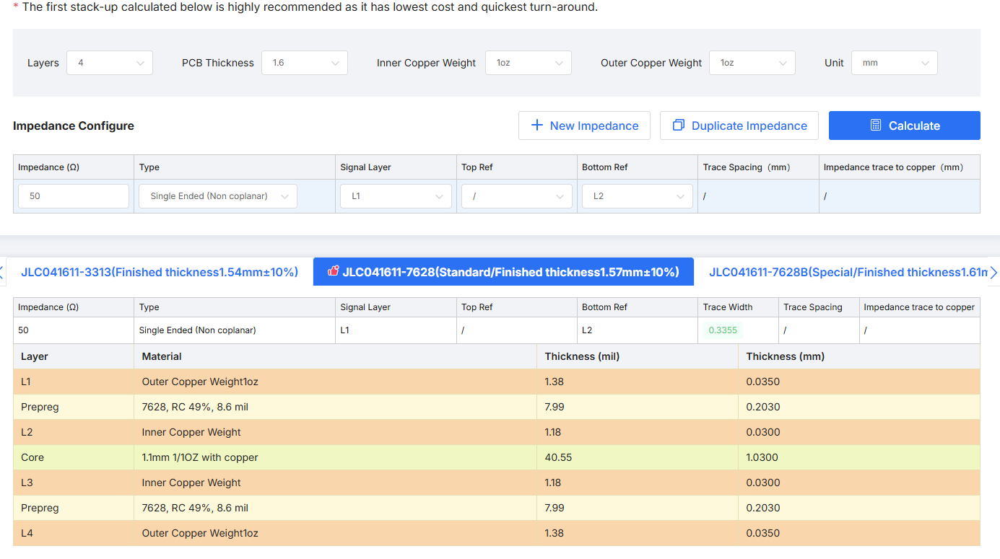
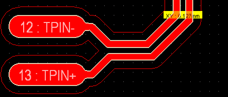
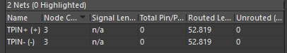
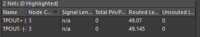
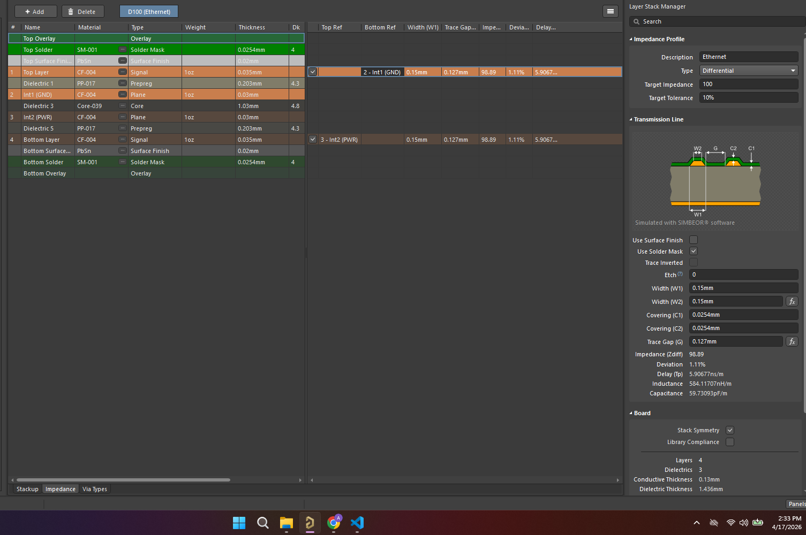

# Thực hành luyện tập layout PCB bài mạch đo dòng và áp có Ethernet

## Layer Impedence control stackup calculator

-   Thickness: 1.6mm
-   Outer cooper weight: 1oz
-   Inner cooper weight: 1oz

So sánh với setting trong ALtium Designer 

     
 

- Bài luyện tập này dùng theo nhà sản xuất JLCPCB có mã là JLC041611-7628 Stackup

- Setting đã được áp dụng vào Altium Designer để tính toán độ trở kháng của đường truyền tín hiệu.

- Tính toán standard impedance của đường truyền tín hiệu là 50 Ohm. Kết quả tính toán được hiển thị trong bảng dưới đây:

- Từ đó cài đặt width của đường truyền tín hiệu là 0.3mm để đạt xấp xỉ (sai số nhỏ) được độ trở kháng chuẩn 50 Ohm.
  
## Tranmission line calculator
Có 2 dây differential pair (100 ohm) được thiết kế cho module Ethernet. Kết quả tính toán được hiển thị trong bảng dưới đây:

Cặp dây đúng với setting tự động tính toán của altium designer.

Đã được length matchinng để đảm bảo độ trễ của tín hiệu được đồng bộ giữa 2 dây trong cặp differential pair.

Cặp còn lại khi route thủ công đã tương đối bằng nhau nên không cần phải length matching nữa.

